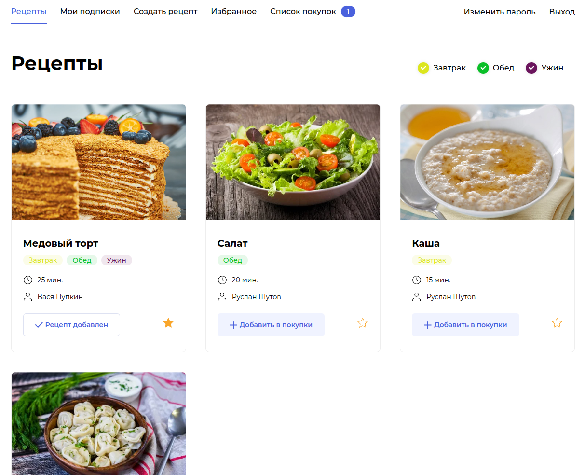

## Продуктовый помощник Foodgram

На этом сервисе пользователи могут публиковать рецепты, подписываться на 
публикации других пользователей, добавлять понравившиеся рецепты в 
список «Избранное», а перед походом в магазин скачивать сводный список 
продуктов, необходимых для приготовления одного или нескольких выбранных блюд 
в txt формате.

<details>
<summary>Обозр Foodgram</summary>



</details>

## Стек технологий


## Установка

*На сервере должны быть установлены Docker и Docker Compose.*

*инструкция для вашей ОС ищите [тут](https://docs.docker.com/engine/install/)*

1. На сервере в домашнем каталоге склонируйте репозиторий:

```
git clone https://github.com/MihVS/foodgram-project-react.git
```

2. В директории проекта зайдите в каталог infra:

```
cd infra
```

3. Создайте файл .env:

```
touch .env
```

4. Откройте файл .env в любом удобном редакторе и заполните по примеру:

```
DB_ENGINE=django.db.backends.postgresql
DB_NAME=postgres
POSTGRES_USER=postgres
POSTGRES_PASSWORD=postgres
DB_HOST=db
DB_PORT=5432
```

5. Запустите docker-compose.yml:

```
docker-compose up -d
```

6. Выполните по очереди команты:

```
docker-compose exec backend python manage.py migrate
docker-compose exec backend python manage.py createsuperuser
docker-compose exec backend python manage.py collectstatic --no-input
docker-compose exec backend python manage.py --csv_import
```


## Разработчик
**[Михаил Шутов](https://github.com/mihvs)**

*[связаться](https://t.me/MihVS)*